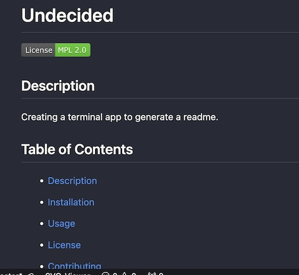

# CODEme

  ## Description
  This is a command-line app to generate README files. It takes user input, formats it in markdown, and saves the file in the "output" directory. 

  ## Screenshots
  

  

  ## Demonstration
    Screencastify video available [here](https://drive.google.com/file/d/172nnySvFvr8OI0f3PZy_PIOiA5My514B/view).

  ## Acknowledgements
  Credit to lukas-h@github for the license badges, provided [here](https://gist.github.com/lukas-h/2a5d00690736b4c3a7ba), created using Shields.io.

